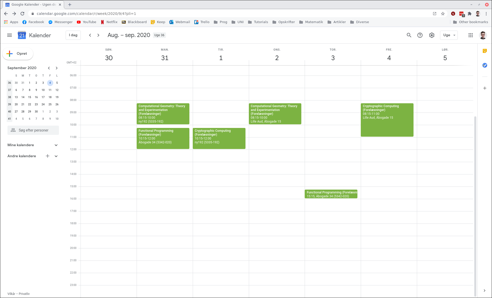
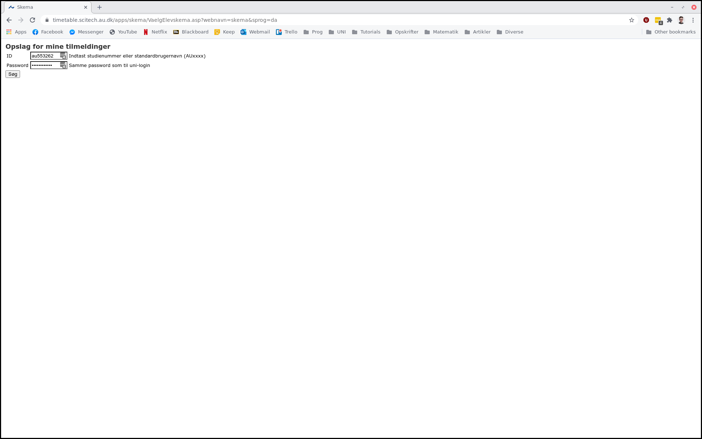
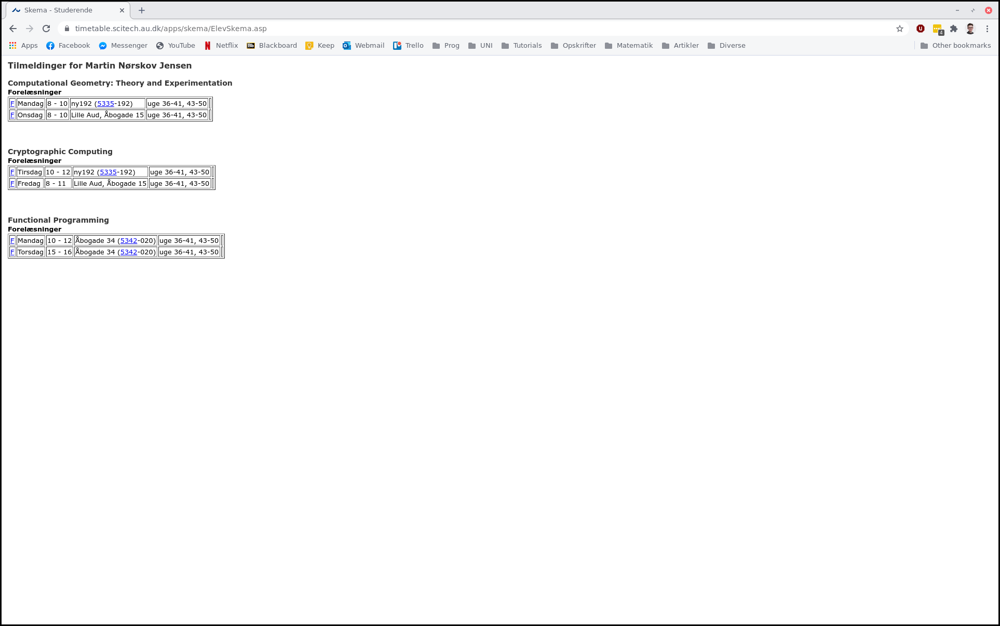
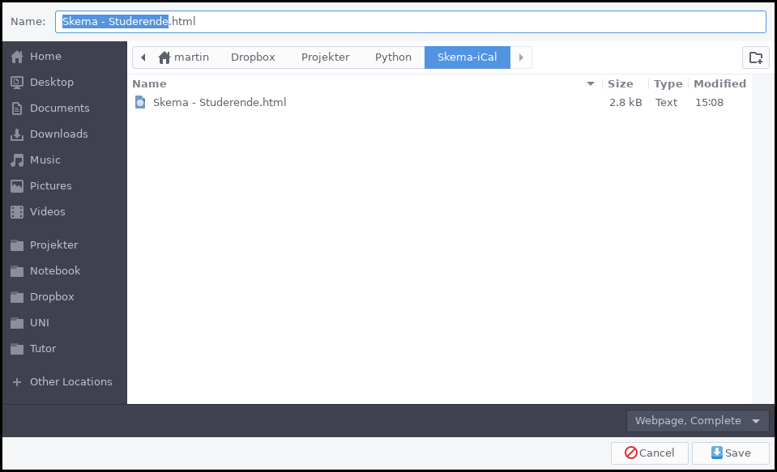

# AU - Skema to iCal

*This is not an official repo*


Since AU added a login page to get course information. It has not been possible to export the course information to your own calendar using existing third party tools. This is now possible using this script on your own computer without sending any login information to me. You just download the html page yourself and use the `skema.py` to get a `skema.ics` file which can be used in your favorite calendar program such as Google Calendar.





I have only tested the script on Google Calendar and thus I don't know whether it works on other Calendar programs such as iCal on MacOS. 


If any mistakes are found please report them as issues or make a pull request. It should be easy to understand as it comply with the PEP8 conventions.


## How to use the script

**Step 1:**

Go to: https://timetable.scitech.au.dk/apps/skema/VaelgElevskema.asp?webnavn=skema&sprog=da



and login with your AU credentials


**Step 2:** 

Download the HTML page by pressing Ctrl+S



**Step 3:**

Save the HTML page in the same folder as this repo as `skema.html`




**Step 4:**

Run the following command in the terminal to get the dependencies for the script

```bash
pip3 install -r requirements.txt
```


**Step 5:**

Run

```bash
python3 skema.py skema.html
```


**Step 6:**

Success you now have a `skema.ics` file which you can use in your favorite calendar program


## Command line arguments

The script supports the following command line arguments: 

```bash
usage: skema.py [-h] [-l] [-n] [-o OUTPUT] filename

Convert skema HTML to ical file

positional arguments:
  filename              the filename of the input file ending in .html

optional arguments:
  -h, --help            show this help message and exit
  -l, --logging         show the log
  -n, --notacademic     turn off academic starting time
  -o OUTPUT, --output OUTPUT
                        output file name ending in .ics
```

